<div align="center">


# GEOApp
### 品牌 AI 智能监测与自动化采集系统

**专为品牌舆情、AI 心智占有率监测打造的 GEO 数据采集客户端**


[📥 立即下载](https://github.com/GunGig/GEOApp/releases) · [💬 联系客服试用订阅](#wechat-contact)

</div>

---

## 目录

- [什么是 GEOApp？](#-什么是-geoapp)
- [核心特性](#-核心特性)
- [运行环境要求](#️-运行环境要求)
- [下载与安装](#-下载与安装)
- [激活授权](#-激活授权)
- [快速使用流程](#️-快速使用流程)
  - [第一步：配置飞书与品牌](#第一步配置飞书与品牌)
  - [第二步：预登录 AI 账号](#第二步预登录-ai-账号)
  - [第三步：开始自动监测](#第三步开始自动监测)
  - [第四步：查看采集结果](#第四步查看采集结果)
- [飞书多维表格结构说明](#-飞书多维表格结构说明)
- [常见问题](#-常见问题)
- [版本更新日志](#-版本更新日志)
- [免责声明](#-免责声明与版权)

---

## 🌐 什么是 GEOApp？

**GEO（Generative Engine Optimization，生成式引擎优化）** 是继 SEO 之后，面向 AI 时代的全新品牌增长策略。随着消费者越来越依赖 AI 大模型进行信息检索与购买决策，品牌在大模型回答中的**曝光频率**与**内容质量**正在成为衡量品牌心智占有率的核心指标。

**GEOApp** 是专为此需求设计的自动化数据采集客户端。它能够模拟真实用户，在豆包、DeepSeek、元宝、文心一言等主流 AI 平台上自动提问，并将品牌相关的 AI 回复内容、引用来源、对话卡片截图批量写入飞书多维表格，实现 **GEO 品牌监测的全流程自动化**。

<div align="center">
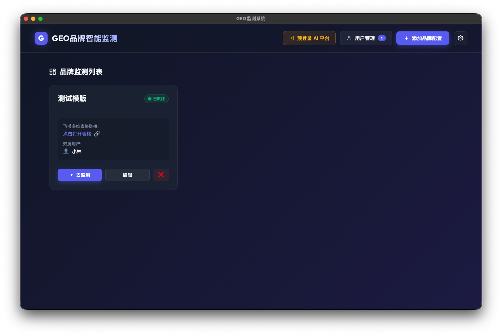
<br><em>GEOApp 主界面 — 任务看板 · 品牌管理 · 实时日志</em>
</div>

<div align="center">
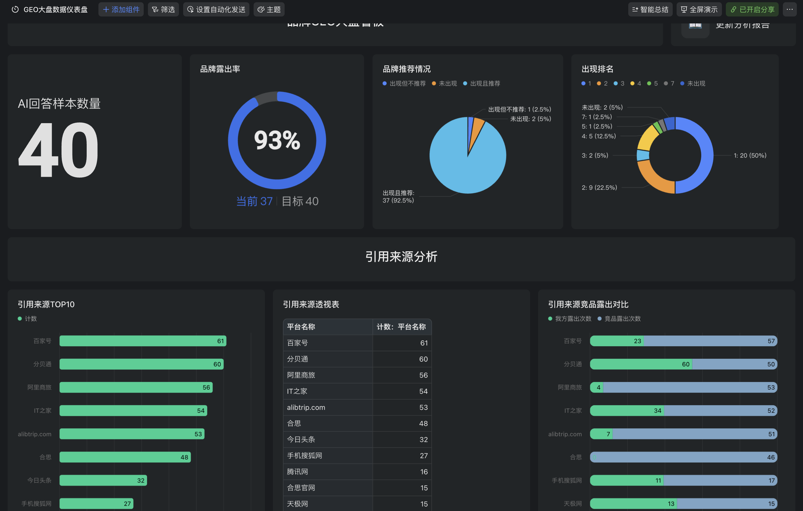
<br><em>飞书数据看板，根据采集到的数据自动分析</em>
</div>
---

## 🌟 核心特性

<table>
<tr>
<td width="50%" valign="top">

### 🤖 多大模型原生支持
完整支持以下主流 AI 对话平台，无需额外配置：
- **豆包 (Doubao)** — 字节跳动
- **腾讯元宝 (Yuanbao)** — 腾讯
- **DeepSeek** — 深度求索
- **文心一言 (Wenxin)** — 百度

</td>
<td width="50%" valign="top">

### 📊 飞书多维表格无缝集成
- 自动读取任务配置表中的问题队列
- 采集结果（回答正文、来源 URL、对话链接、截图）一键批量回写
- 支持多品牌独立表格空间，互不干扰

</td>
</tr>
<tr>
<td width="50%" valign="top">

### 📸 智能高亮卡片截图
- 自动定位并高亮回答中的品牌关键词
- 完整截取超长对话卡片（支持 10000px+ 长图）
- 全程强制日间模式，截图风格统一

</td>
<td width="50%" valign="top">

### 🔑 免密沙盒登录管理
- 一次预登录，Cookie 本地安全存储
- 多品牌账号独立沙盒，互不污染
- 后续采集无需人工干预，全程后台静默运行

</td>
</tr>
<tr>
<td width="50%" valign="top">

### 🛡️ 高稳定性抗检测机制
- 深度适配各平台反机器人策略
- 自动处理元素加载超时、弹窗拦截、剪贴板读写限制
- 选择器动态容错，适应平台频繁改版

</td>
<td width="50%" valign="top">

### ⚡ 智能启动验证
- 启动时联网验证授权码，安全可靠
- 加载动画期间同步检查版本更新
- 有新版本时在启动页直接提示，不打断工作流

</td>
</tr>
</table>

---

## 🖥️ 运行环境要求

| 项目 | 要求 |
|------|------|
| **操作系统** | macOS 11.0 (Big Sur) 及以上 |
| **芯片架构** | Apple Silicon (M1/M2/M3/M4) 及 Intel 均支持 |
| **浏览器** | 系统需安装 **Google Chrome**（建议最新版） |
| **网络** | 需要稳定网络，系统每次启动均会联网验证授权 |
| **ChromeDriver** | 无需手动下载，系统自动管理 |

> [!NOTE]
> GEOApp 不支持 Windows 系统。若您有 Windows 使用需求，请联系授权团队。

---

## 📦 下载与安装

### 第一步：下载安装包

前往 **[Releases 页面](https://github.com/GunGig/GEOApp/releases/latest)** 下载最新版 `.dmg` 安装文件：

<div align="center">
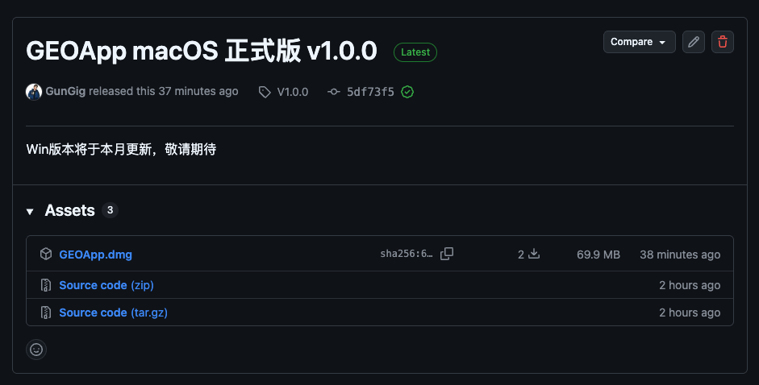
<br><em>在 Releases 页面点击 .dmg 文件进行下载</em>
</div>

### 第二步：安装应用

1. 双击下载好的 `GEOApp.dmg` 文件，等待挂载。
2. 在弹出的安装窗口中，将 **GEOApp** 图标拖入右侧的 **Applications（应用程序）** 文件夹。
3. 等待复制完成后，弹出磁盘映像，即可在启动台或应用程序文件夹找到 GEOApp。

<div align="center">
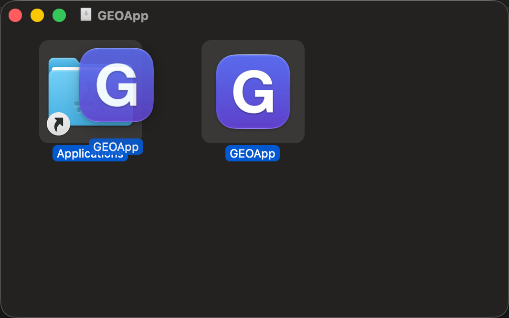
<br><em>将 GEOApp 拖入 Applications 文件夹完成安装</em>
</div>

### 第三步：解除 macOS 安全限制

> [!IMPORTANT]
> **关于「应用已损坏」或「无法验证开发者」提示的解决方法**
>
> 由于本软件未在 Mac App Store 上架，macOS Gatekeeper 可能阻止首次运行。请按以下步骤处理：
>
> **方法 A（推荐）**：打开「终端」（Terminal.app），粘贴以下命令并按回车：
> ```bash
> sudo xattr -r -d com.apple.quarantine /Applications/GEOApp.app
> ```
> 输入电脑开机密码确认后，重新双击 GEOApp 即可正常运行。
>
> **方法 B**：前往「系统设置 → 隐私与安全性」，在页面底部点击「仍要打开」。

<div align="center">
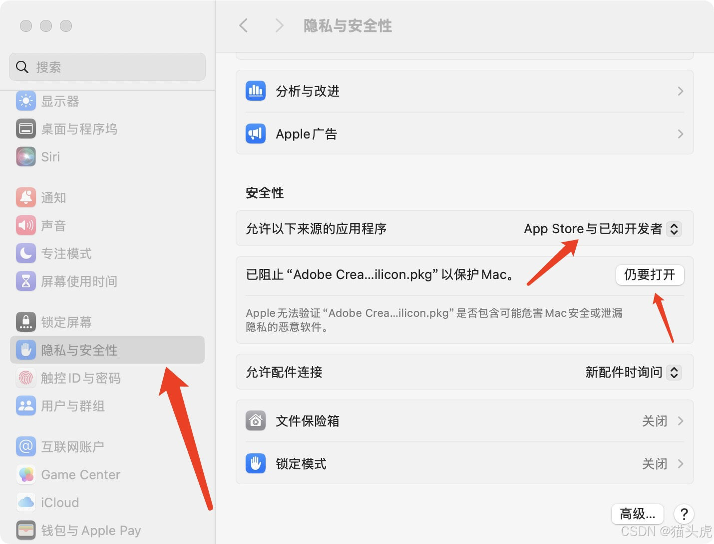
<br><em>「仍要打开」按钮位于系统设置 → 隐私与安全性页面底部</em>
</div>

---

## 🔐 激活授权

首次运行 GEOApp 时，系统将进入授权激活界面。请按以下步骤完成激活：

1. 在激活页面中，复制显示的**机器码**，发送给授权团队。
2. 授权团队将为您生成专属 **License Key**（格式：`GEOAPP-XXXX-XXXX-XXXX`）。
3. 将 License Key 填入输入框，点击**「激活」**按钮。
4. 联网验证通过后，自动进入主界面。

<div align="center">
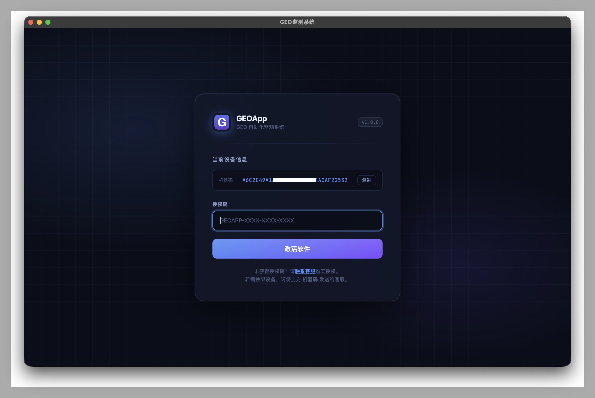
<br><em>授权激活页面 — 输入 License Key 完成激活</em>
</div>

> [!NOTE]
> - License Key 与**设备机器码绑定**，每台设备需单独授权。
> - 每次启动均需联网验证，请确保网络通畅。

---

## ⚙️ 快速使用流程

### 第一步：配置飞书与品牌

在开始采集前，需要完成飞书应用的创建与品牌信息的绑定。

**1.1 添加用户**

在主界面左下角添加用户，用户名自定义（方便后续为不同品牌指定采集归属人）。然后点击「前往飞书平台创建应用」，按照以下步骤操作：

<div align="center">
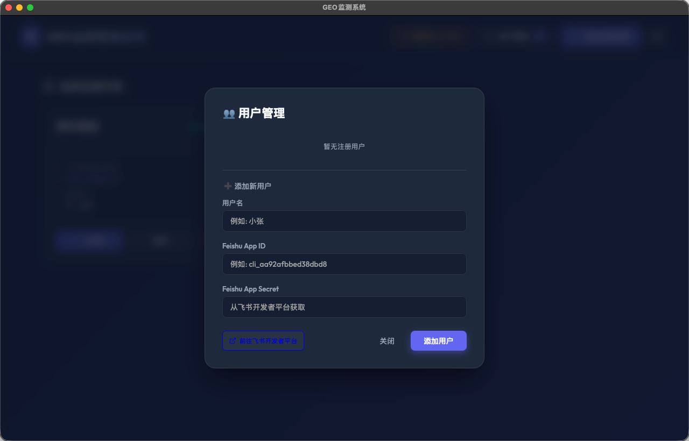
</div>

<div align="center">
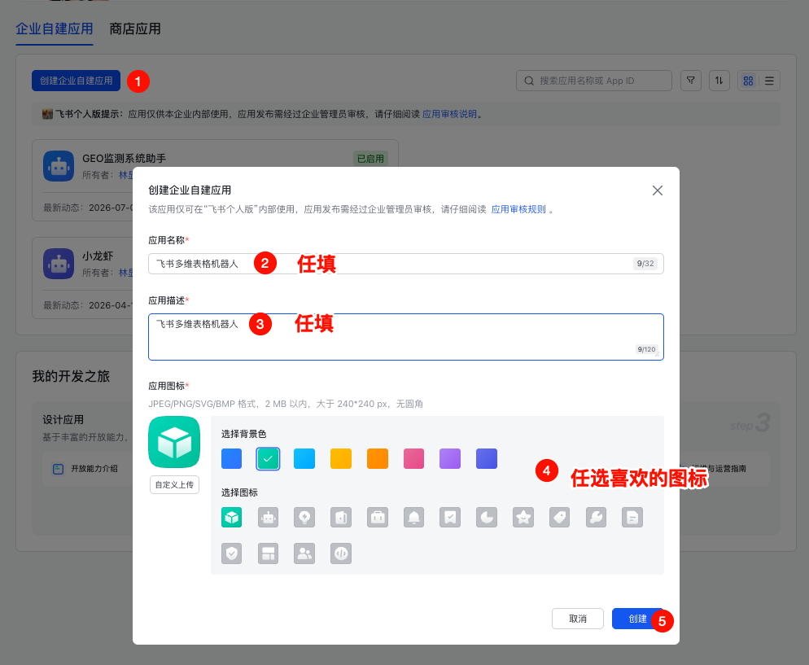
</div>

<div align="center">
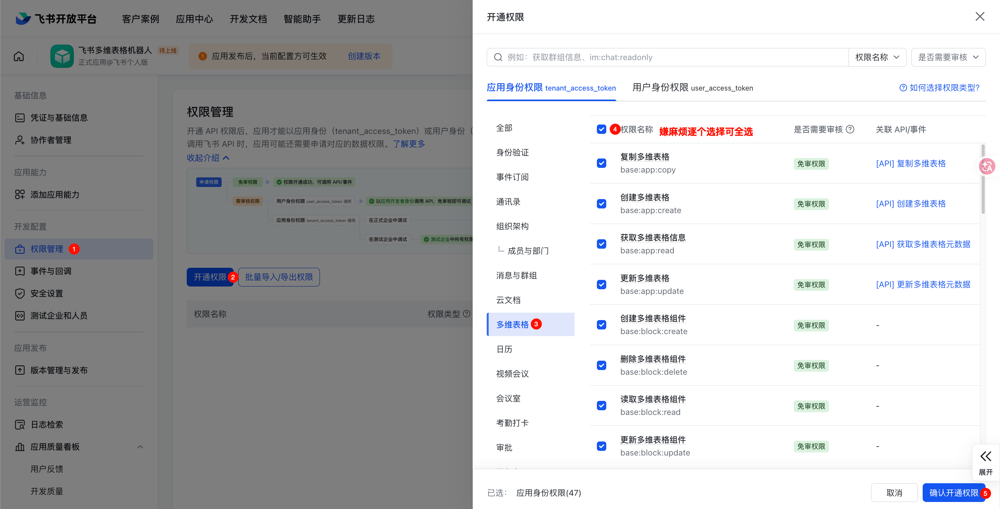
</div>

<div align="center">
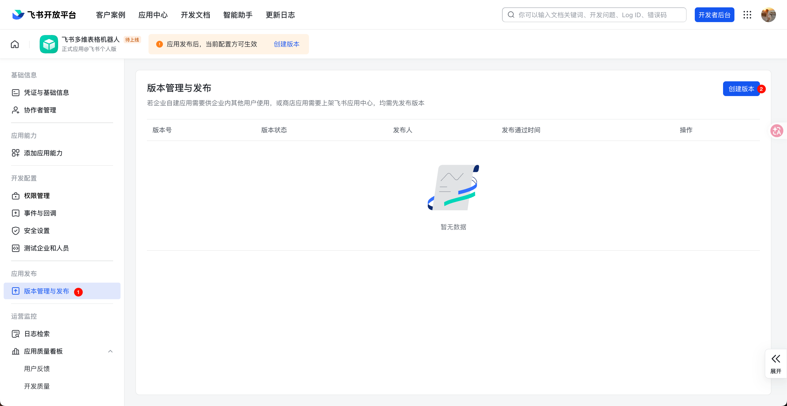
</div>

> [!IMPORTANT]
> 飞书自建应用**必须发布**，否则无法调用 API 实现自动化写入。

<div align="center">
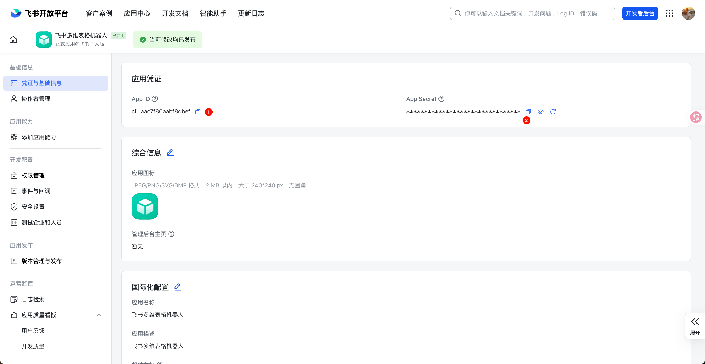
</div>

**1.2 填入飞书应用凭证**

应用创建完成后，将以下两个密钥填入 GEOApp 对应品牌的配置中：
- **App ID**
- **App Secret**

**1.3 创建并配置多维表格**

点击以下链接，打开模板多维表格并创建属于自己的副本：

> 📋 **[点击此处打开飞书多维表格模板](https://my.feishu.cn/base/KWK9bOvtDadBjvsBBZQcIJ3JnYg?from=from_copylink)**

完成副本创建后，需将刚才创建的飞书自建应用**添加到该多维表格**，并赋予读写权限：

<div align="center">
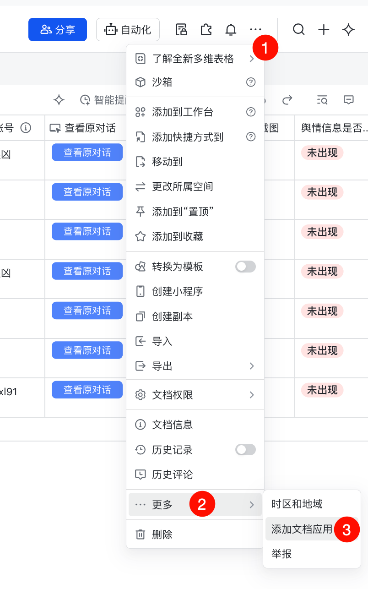
</div>

<div align="center">
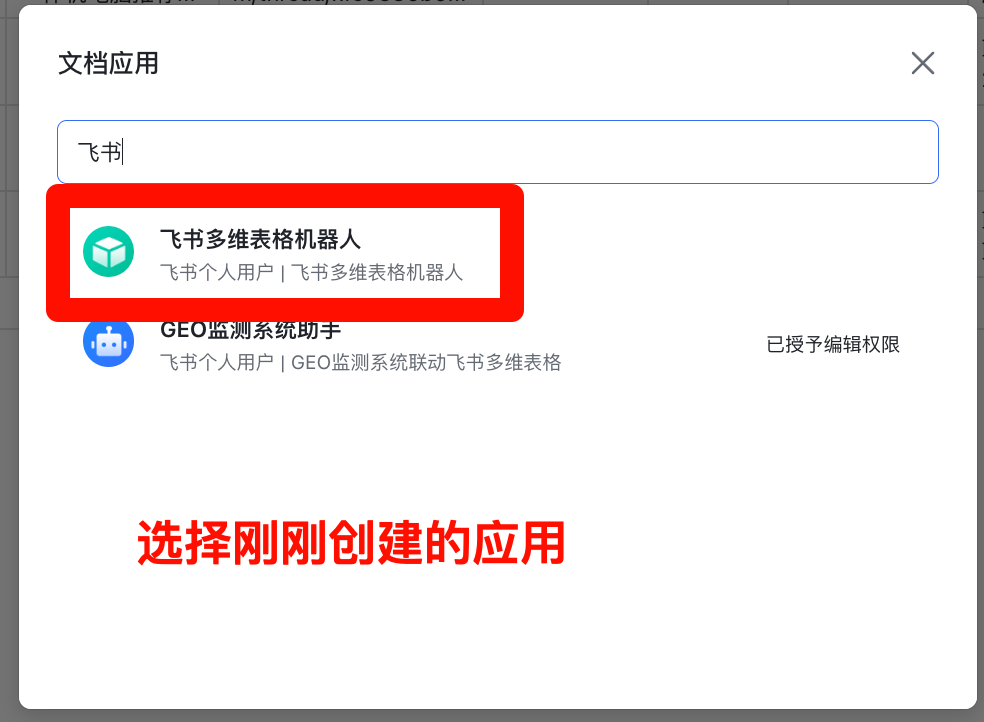
</div>

<div align="center">
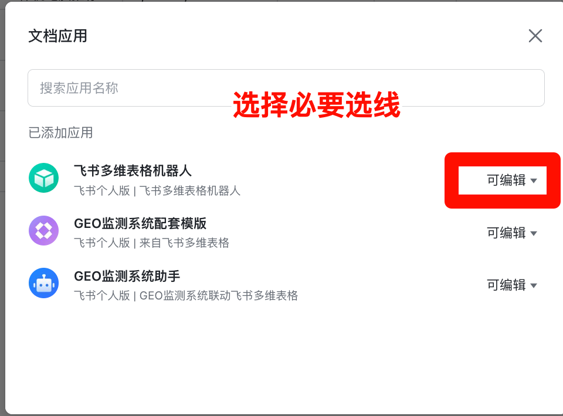
</div>

**1.4 添加品牌**

在主界面的**「品牌管理」**区域，点击「➕ 添加品牌」，填写以下信息：

| 配置项 | 说明 |
|--------|------|
| **品牌名称** | 用于区分不同品牌任务的标识名 |
| **飞书 App ID / App Secret** | 飞书自建应用的凭证（需有多维表格读写权限） |
| **多维表格分享链接** | 上一步创建的副本链接 |
| **品牌关键词** | 用于截图中自动高亮的词语，多个词用逗号分隔 |

<div align="center">
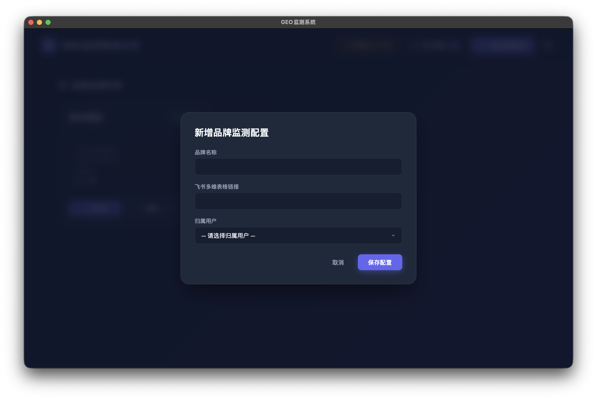
<br><em>品牌配置面板 — 填写飞书应用凭证与表格链接</em>
</div>

配置完成后，系统会自动检测飞书多维表格连接状态，状态指示灯变为绿色（✅ 已就绪）即表示配置成功。

---

### 第二步：预登录 AI 账号

采集前需要为每个目标 AI 平台完成**一次性预登录**，以保存 Cookie 状态供后续无感采集使用。

1. 在主界面选择对应品牌，进入**「预登录管理」**选项卡。
2. 点击对应平台（如「豆包」）的**「🚀 预登录」**按钮。
3. 系统将自动启动一个专属 Chrome 浏览器窗口，打开 AI 平台登录页。
4. **手动完成扫码或手机号验证码登录**。
5. 登录成功后，GEOApp 将自动检测并保存登录状态，浏览器自动关闭。

<div align="center">
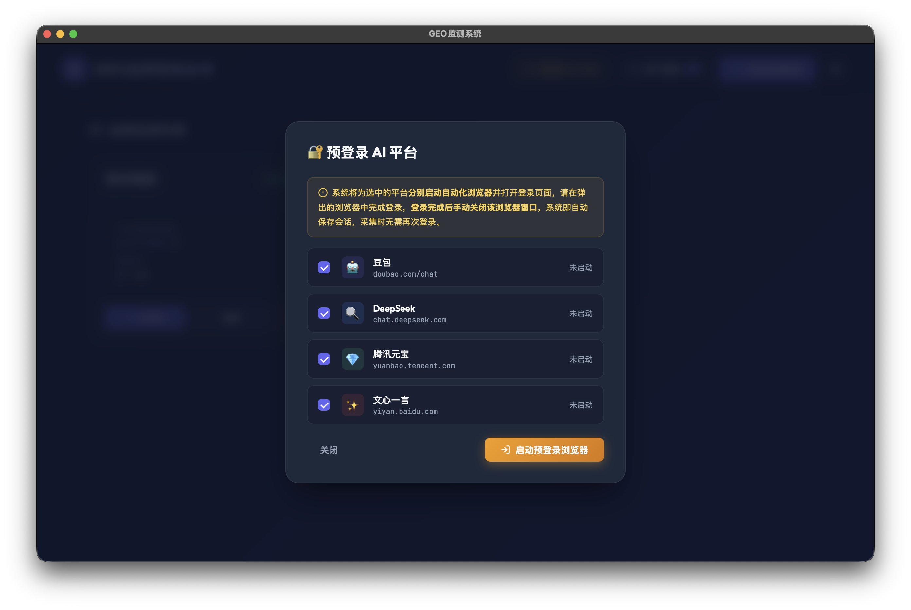
<br><em>预登录管理 — 各平台登录状态一览</em>
</div>

> [!TIP]
> 预登录的 Cookie 状态通常可持续数天至数周。当采集过程中发现某平台因 Cookie 失效而失败时，重新执行一次预登录即可。

---

### 第三步：开始自动监测

> [!NOTE]
> 开始前请确认飞书多维表格中已填写好本品牌的**提问词**，并清空上次采集的历史数据。

1. 在主界面确认**目标品牌**、**目标 AI 平台**、**任务问题数量**无误。
2. 点击**「▶️ 开始监测」**按钮，GEOApp 开始全自动执行任务。
3. 右侧**实时日志面板**将逐条显示每个问题的采集进度与结果。

<div align="center">
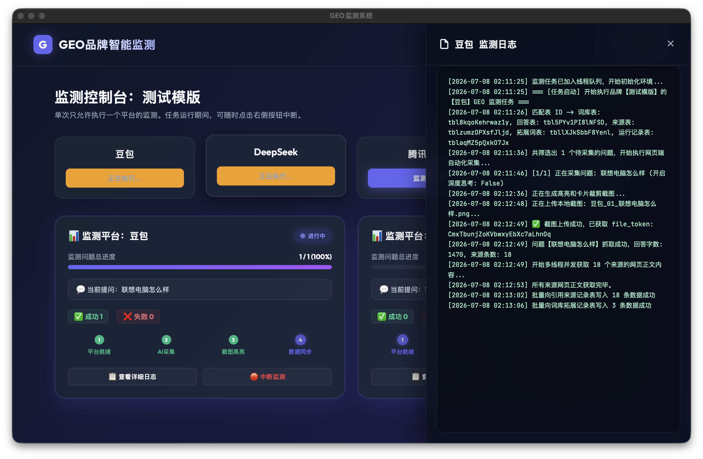
<br><em>任务运行中 — 实时日志显示每条问题的采集状态</em>
</div>

**每条问题的完整采集流程**（全自动）：

```
读取飞书问题 → 打开AI平台 → 发送问题 → 等待深度思考完成
     ↓
高亮品牌关键词 → 截取完整对话卡片 → 提取正文与引用来源
     ↓
上传截图至飞书 → 将所有字段写回多维表格 → 标记完成
```

---

### 第四步：查看采集结果

采集完成后，所有数据将自动写入飞书多维表格的**「数据采集表」**，包含：

- ✅ AI 回答正文全文
- ✅ 对话分享链接
- ✅ 引用来源网址列表
- ✅ 对话卡片高清截图（内嵌至单元格）
- ✅ 品牌词在回答中的提及次数
- ✅ 采集时间戳与执行状态

<div align="center">
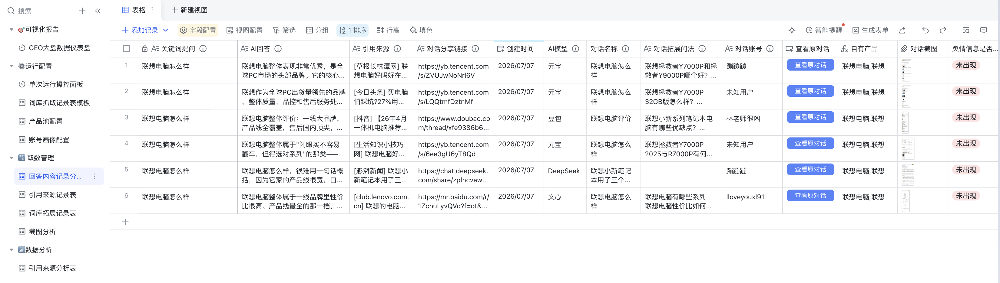
<br><em>飞书多维表格数据采集表 — 自动写回的结构化数据与截图</em>
</div>

---

## 📋 飞书多维表格结构说明

GEOApp 依赖以下表格结构，首次使用前请在飞书中按此规范创建对应子表：

### 配置表（任务问题队列）

| 字段名 | 类型 | 说明 |
|--------|------|------|
| 问题 | 文本 | AI 将被问到的原始问题 |
| 拓展问法 | 文本 | 问题的多种表述方式，系统随机选择 |
| 目标平台 | 多选 | 豆包 / 元宝 / DeepSeek / 文心一言 |
| 是否启用 | 复选框 | 未勾选的问题将被跳过 |

### 数据采集表（结果写回）

| 字段名 | 类型 | 说明 |
|--------|------|------|
| 问题 | 文本 | 实际发送的问题文本 |
| AI 平台 | 单选 | 采集来源平台 |
| 回答正文 | 文本 | AI 的完整回答内容 |
| 对话链接 | URL | 该次对话的分享链接 |
| 参考来源 | 文本 | AI 引用的参考网址列表 |
| 对话截图 | 附件 | 高清对话卡片截图 |
| 采集时间 | 日期 | 任务执行时间戳 |
| 状态 | 单选 | 成功 / 失败 / 跳过 |

---

## ❓ 常见问题

<details>
<summary><strong>Q：采集时提示「豆包登录已失效」怎么办？</strong></summary>

Cookie 有有效期，当平台检测到异常或长时间未使用时会失效。重新进入**预登录管理**，对该平台执行一次预登录即可恢复。
</details>

<details>
<summary><strong>Q：截图是黑色/暗色的？</strong></summary>

系统已内置强制日间模式，但若您的 macOS 系统在采集时正好切换到夜间模式可能导致此问题。建议将 macOS 设置为「始终使用浅色外观」（系统设置 → 外观 → 浅色），以确保截图风格统一。
</details>

<details>
<summary><strong>Q：采集过程中 Chrome 窗口一直显示在前台，能否后台运行？</strong></summary>

目前采集任务会显示 Chrome 窗口，这是为了确保截图功能的正常工作（部分平台在无头模式下无法正常滚动与截图）。建议采集期间将 GEOApp 及 Chrome 窗口移至独立的 macOS 虚拟桌面（Space）。
</details>

<details>
<summary><strong>Q：飞书连接失败，状态显示「❌ 未就绪」？</strong></summary>

请检查以下几点：
1. 飞书自建应用的 **App ID 和 App Secret** 是否填写正确。
2. 飞书应用是否已获得「多维表格」的**读写权限**并发布。
3. 多维表格的**分享链接**是否有效，表格所有者是否已将该应用加入授权。
</details>

<details>
<summary><strong>Q：可以同时对多个品牌、多个平台并发采集吗？</strong></summary>

当前版本采用顺序执行模式（一个品牌 × 多个平台），以确保稳定性并避免被 AI 平台检测为机器人。并发模式将在后续版本中推出。
</details>

---

## 📝 版本更新日志

### v1.0.1 `2026-07-17`
- 🔧 修复：豆包、元宝、DeepSeek 采集器在异常退出后重启时 Chrome 锁文件残留导致的启动失败问题
- 🔧 修复：spec 配置补充剪贴板权限声明，提升分享链接提取稳定性

### v1.0.0 `2026-07-08`
- 🎉 正式发布，支持豆包、元宝、DeepSeek、文心一言四大平台
- ✅ 飞书多维表格全自动读写
- ✅ 品牌关键词智能高亮截图
- ✅ 授权码 + 机器码双重验证
- ✅ 启动加载动画 + 在线版本更新推送

---

## 📄 免责声明与版权

- 本软件仅供**已授权用户**在合法授权范围内使用，用于品牌 AI 监测分析用途。
- 使用者须自行遵守各 AI 平台（豆包、DeepSeek、元宝、文心一言等）的**服务条款**，以及《网络安全法》《数据安全法》等相关法律法规，如有任何违规自行承担。
- 本软件所采集的数据版权归各 AI 平台所有，使用者不得将采集数据用于任何侵权用途。
- **开发团队不对因违规使用造成的任何直接或间接损失承担责任。**

---

<div align="center">

© 2026 GEOApp 开发团队 · 保留所有权利

<a id="wechat-contact"></a>
如需商务授权或技术支持，请扫码联系
<div align="center">

</div>

</div>
